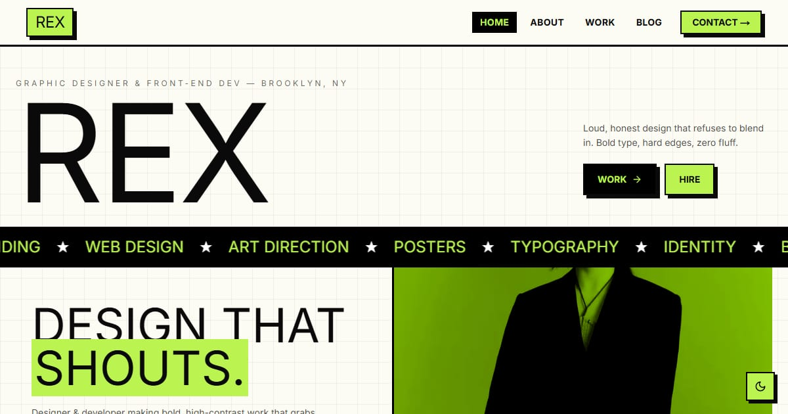

# Rex — Graphic Designer & Front-end Dev

Portfolio template for Rex, a fictional graphic designer and front-end developer: loud neo-brutalist case studies that link to six live demo sites, plus articles on opening hours, radio schedules, and liner notes.

**Demo live:** https://portfolio-rex-zeta.vercel.app



> Template portfolio dengan persona fiktif. Semua proyek di dalamnya adalah demo live dari koleksi yang sama; tidak ada klien, testimoni, atau logo merek sungguhan. Formulir kontak hanya demo dan mengatakannya.

## Konsep

Persona fiktif Rex, desainer grafis yang juga menulis kode. Neo-brutalis: garis hitam tebal, bayangan keras, blok lime, judul Anton, dan teks Space Mono; mode gelap memakai garis terang dan bayangan lime.

## Isi

- **6 studi kasus** (`/work/[slug]`): tantangan, yang dikerjakan, hasil, dan tautan ke situs live-nya.
- **3 artikel** (`/blog/[slug]`) tentang keputusan desain di proyek-proyek tersebut.
- Angka yang tampil (jumlah proyek, layanan, artikel) dihitung dari isi situs; lama berkarya adalah bagian dari persona fiktif. Tidak ada klaim jumlah klien atau tingkat kepuasan.
- Halaman 404 bergaya sendiri, judul halaman berpola `Halaman — Rex`, dan sitemap memuat setiap studi kasus dan artikel.

| Studi kasus | Demo live |
| --- | --- |
| Disko Panda | https://linkinbio-disko.vercel.app |
| Kaset Kita FM | https://linkinbio-kaset.vercel.app |
| Laras | https://linkinbio-vinyl.vercel.app |
| Jajanan Bu Rina | https://linkinbio-jajan.vercel.app |
| Tasty Corner | https://landing-tastycorner.vercel.app |
| Modewear | https://landing-modewear.vercel.app |

## Halaman

`/` · `/about` · `/work` · `/work/[slug]` · `/blog` · `/blog/[slug]` · `/contact`

## Gambar & kredit

- `public/images/work/*.webp` — tangkapan layar demo live di tabel atas (karya koleksi ini sendiri).
- `public/images/hero.webp` — "Designer Logo" oleh Messala Ciulla, [StockSnap](https://stocksnap.io/photo/designer-logo-GW7VC9EJ0X), lisensi CC0.
- `public/images/about.webp` — "Office Work" oleh Negative Space, [StockSnap](https://stocksnap.io/photo/office-work-VHXFNKMU96), lisensi CC0.

## Teknologi

- Next.js 15.5 (App Router) dan React 19
- Tailwind CSS v4
- JavaScript
- Framer Motion, Lucide (ikon), next-themes (mode gelap/terang)
- Font: Inter, Anton, Space Mono (next/font)
- SEO: metadata per halaman, Open Graph, JSON-LD (WebSite), sitemap.xml, dan robots.txt

## Menjalankan secara lokal

```bash
npm install
npm run dev
```

Buka http://localhost:3000. Untuk build produksi: `npm run build` lalu `npm start`.

---

Bagian dari koleksi 7 template portfolio personal di [PortalPorto](https://www.pintuweb.com/website-portofolio). Dibuat oleh [PintuWeb](https://www.pintuweb.com), jasa pembuatan website.
